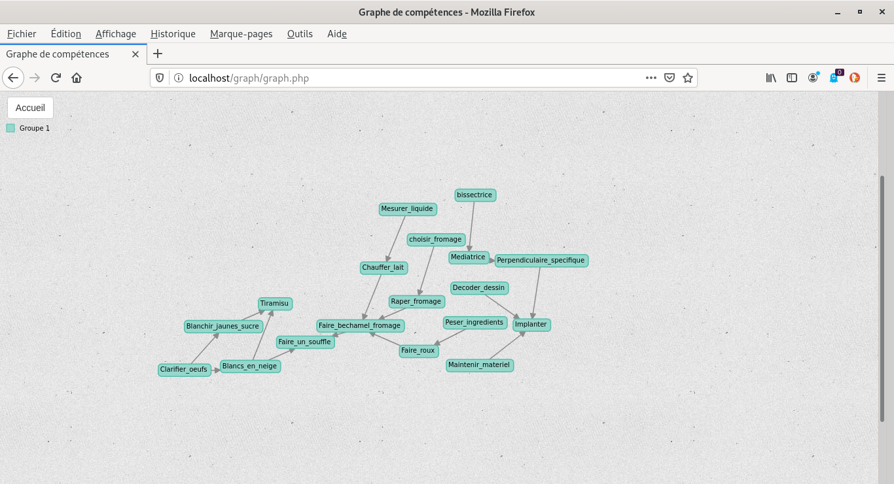
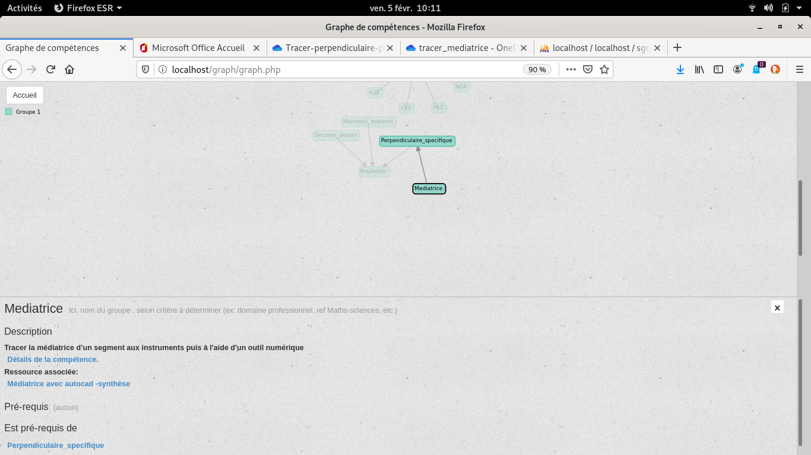
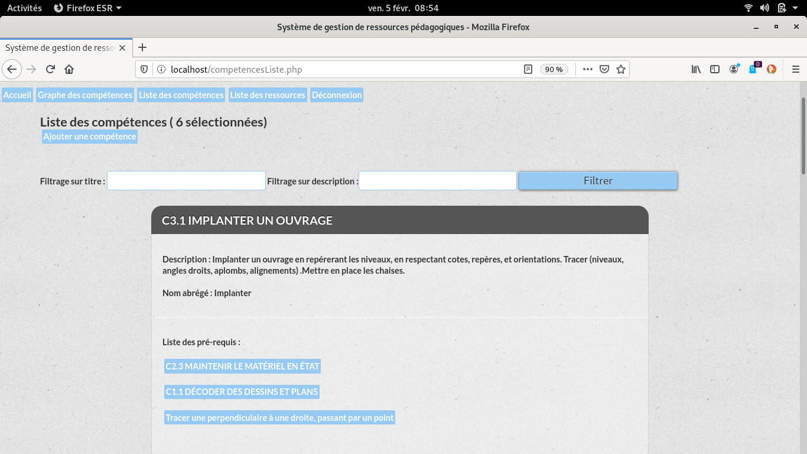
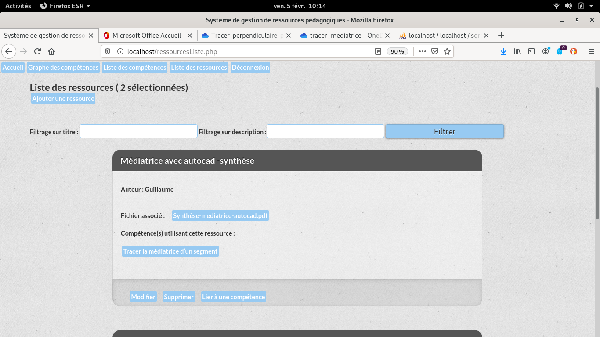
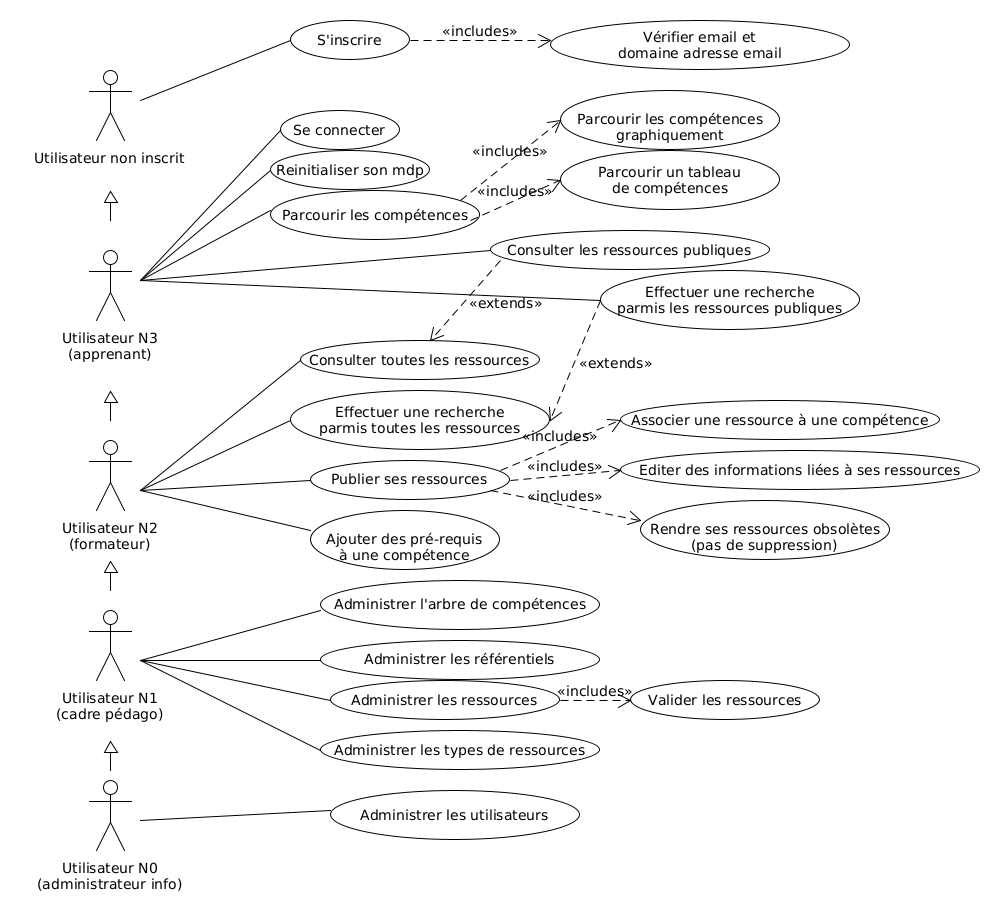
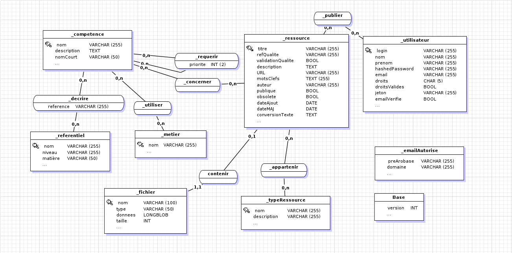
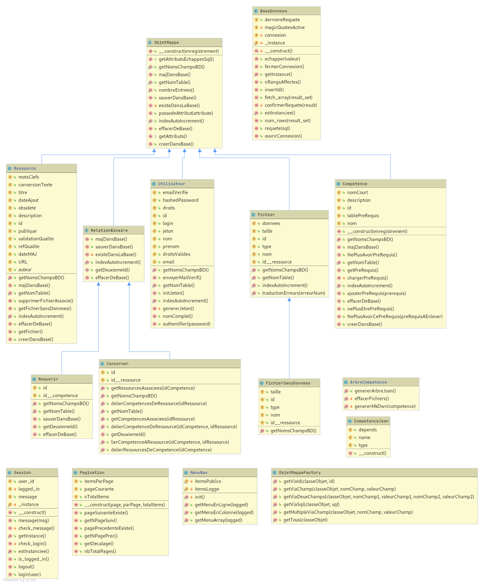

# Projet NFE114

## Développement d'une application web d'ingénierie pédagogique

Guillaume Laisney


## Introduction


L'application développée répond à un besoin des centres de formation gérés par l'association qui m'emploie :  disposer d'un outil de gestion des ressources pédagogiques qui permettrait de faciliter la liaison entre les situations professionnelles et les enseignements généraux, et à  terme  mutualiser et organiser des ressources pédagogiques par compétence.


## Aperçu

L'idée centrale est de pouvoir consulter visuellement un graphe de compétences.




L'application donne accès aux ressources liées aux compétences du graphe.




Elle permet de gérer les compétences, et d'effectuer des recherches.




Des ressources peuvent être associées aux compétences sous forme de fichiers ou d'URL.




## Diagramme des cas d'utilisation

Ce diagramme est assez peu détaillé, mais il m'a permis de communiquer sur le projet et de structurer le développement. Certains cas d'utilisation ne sont pas encore implémentés (principalement l'administration des utilisateurs).




## Modèle conceptuel de données

Le MCD ci-dessous permettra d'implémenter de nombreuses fonctionnalités. Nous allons aborder ci-dessous les entités essentielles du modèle.



### L'entité compétence

L'entité centrale du MCD est la compétence. Elle possède un nom unique comme "Tracer la médiatrice d'un segment au compas". Son nom abrégé unique, par exemple "Mediatrice_compas"  permet son affichage dans le graphe visuel. On peut adjoindre une description de la compétence.

L'association réflexive "requérir" lie une compétence A à une compétence B, B étant un pré-requis nécessaire pour acquérir A selon un degré d'importance qui peut être spécifié à l'aide du champ "priorité".

Une compétence peut être décrite dans un référentiel, par exemple le programme de mathématiques de bac pro.

Elle peut être utilisée par un métier.


### L'entité ressource

Il s'agit également d'une entité fondamentale pour l'application. Une ressource peut être liée à des compétences.

L'information principale stockée par une instance de ressource sera une URL ou un fichier associé (ou les deux).

Pour classer les ressources, des types de ressource seront définis, par exemple : fiche exercices, fiche synthèse, évaluation.

La ressource sera associée à l'utilisateur qui l'aura publiée.


### Cardinalités

Toutes les associations sont de type [0,n] - [0,n],  mise à part "contenir" qui lie un éventuel fichier à une ressource. J'ai initialement fait ce choix afin de pousser les utilisateurs à saisir une description détaillée de chaque fichier, mais je ferai certainement évoluer l'application pour qu'une ressource puisse contenir plusieurs fichiers.


## Diagramme de classes

Ce diagramme est celui de l'application actuelle. Il est presque au format UML.  Les classes et méthodes abstraites se distinguent par une petite barre verticale dans le "c" ou le "m"  coloré, pour les classes ObjetMappé et RelationBinaire.

Les méthodes et champs statiques ont un petit carré gris à gauche dans le disque coloré.





### La classe ObjetMappé

Cette classe est centrale dans l'application et comme son nom l'indique, elle fait le lien entre la base de données et les objets de l'application.

Pour créer un tel objet, il suffit de le faire hériter de cette classe, de définir trois méthodes très basiques et de créer la liste des attributs correspondants exactement à ceux de la base. J'ai utilisé de manière simpliste le patron Template Method : les trois méthodes sont définies dans les classes filles et utilisées par la classe mère ObjetMappé.

Pour illustrer le fonctionnement de cette classe, voici l'implémentation de celle qui permet de manipuler les fichiers.

```php
class Fichier extends ObjetMappe
{
    public $id;
    public $nom;
    public $type;
    public $taille;
    public $donnees;
    public $id__ressource;

    public static function getNomTable(): string
    {
        return '_fichier';
    }

    public static function indexAutoIncrement(): bool
    {
        return true;
    }

    public static function getNomsChampsBD(): array
    {
        return array(
            'id',
            'id__ressource',
            'nom',
            'type',
            'taille',
            'donnees');
    }
    
}

```


La classe Fichier est alors directement utilisable avec la base. Voici par exemple le code qui suffit à enregistrer un fichier à partir de variables initialisées.

```php
  		$fichier = new Fichier();
        $fichier->nom = $filename;
        $fichier->type = $file_type;
        $fichier->taille = $file_size;
        $fichier->donnees = $content;
        $fichier->id__ressource = $idRessource;

        if ($fichier->creerDansBase()) {
            $message = 'Le fichier a bien été envoyé.<br/>';
        } else {
            $message .= 'Erreur lors de l\'envoi du fichier.';
        }
```


Le constructeur de la classe ObjetMappé utilise un tableau qui associe les noms des champs à leurs valeurs.

On teste par introspection l'existence des champs du tableau et on les instancie  ( l'introspection est beaucoup plus abordable en PHP qu'en Java !)

Les méthodes de lecture de la base ont été extraites de la classe ObjetMappé car j'ai rencontré des difficultés avec les méthodes statiques et le "late static binding" de PHP (une différence cette fois à l'avantage de Java). Je n'ai pas insisté et j'ai crée une classe ObjetMappéFactory.


### La classe ObjetMappéFactory

On utilise ici le patron fabrique pour instancier les objets à partir de la base. Toutes les méthodes reposent sur  getViaSQL qui instancie à partit d'une requête un ou plusieurs objets connaissant leur classe. On voit encore ici que l'introspection en PHP permet d'instancier très facilement un objet à partir du nom de sa classe : il suffit d'appeler "new $classeObjet(PARAMETRES)".

```php
public static function getViaSql($classeObjet, $sql = ""): array
    {
        $database = BaseDonnees::getInstance();
        $result_set = $database->requete($sql);
        $object_array = array();
        while ($row = $database->fetch_array($result_set)) {
            $object_array[] = new $classeObjet($row);
        }
        return $object_array;
    }
```


Les méthodes d'ObjetMappéFactory exploitent ensuite getViaSQL pour construire un ou plusieurs objets à partir d'arguments. Voici le code qui permet d'instancier un objet à partir d'un champ de valeur donnée.

```php
    public static function getViaChamp($classeObjet, $nomChamp, $valeurChamp): ObjetMappe
    {
        $res = self::getViaSql($classeObjet, "SELECT * FROM " . $classeObjet::getNomTable() . " WHERE {$nomChamp}='{$valeurChamp}' LIMIT 1");
        if (empty($res)) throw new Exception("Objet de classe {$classeObjet}, dont le champ {$nomChamp} à pour valeur: {$valeurChamp} -- non trouvé.");

        return $res[0];

    }
```


L'application est ainsi relativement découplée du moyen de stockage utilisé : toutes les requêtes SQL sont situées dans ObjetMappé et ObjetMappéFactory.  Enfin, les spécificités liées à l'utilisation de MariaDB se situent dans la classe BaseDonnees.


### La classe BaseDonnees

Cette classe est un singleton qui gère la connexion à la base et se charge d'effectuer les requêtes, ainsi que de logger les erreurs éventuelles après une requête. On y trouve aussi une  méthode qui permet d'échapper les caractères spéciaux incompatibles avec les requêtes SQL.


### Les classes filles d'ObjetMappé

Voici quelques détails sur les fonctionnalités apportées par ces classes

#### Utilisateur

Fournit notamment les méthodes d'authentification et d'inscription

#### Compétence

Implémente principalement la gestion du graphe qui amène une interdépendance des compétences. Par exemple, pour supprimer une compétence, ont doit d'abord la désolidariser de ses pré-requis.

#### Ressource

Gère notamment les liens avec les fichiers associés.


#### RelationBinaire

Classe abstraite qui modifie objetMappé pour le cas particulier des associations.

"**Requérir**" et "**Concerner**" héritent de cette classe, et c'est dans" Concerner" que l'on effectue la gestion des associations entre ressources et compétences.


#### Fichier 

Permet le stockage de fichiers sous forme de BLOB dans la base. J'ai longtemps hésité entre un stockage sur système  de fichiers ou dans la base. J'ai retenu le stockage en base principalement parce qu'il améliore la portabilité de l'application et permet de simplifier et sécuriser les sauvegardes et restaurations


#### FichierSansDonnees

Hérite de la classe Fichier, et redéfinit juste les champs utilisés en omettant  le BLOB. Cette classe permet d'alléger les traitements pour les affichages de ressources par exemple, lors desquels le contenu du fichier est dans un premier temps inutile.  


#### La classe Session

Pour gérer la connexion et les messages entre pages, on utilise à nouveau un singleton.

#### La classe Pagination

Cette classe gère l'affichage d'un nombre limité d'items par page lors du parcours des listes de compétences et de ressources.


#### La classe ArbreCompétences

Permet de générer les fichiers nécessaires à la visualisation du graphe de compétences.


## Architecture MVC

Toutes les pages ont été construites avec une vue et un contrôleur dans le même fichier. Je pense par la suite simplifier encore certaines vues, et déplacer certaines fonctionnalités des contrôleurs vers les modèles.


## Tests unitaires

J'ai utilisé PHPUnit pour implémenter des tests unitaires. Cet outil est extrêmement utile et amène une certaine tranquillité d'esprit, notamment lors de modifications des classes fondamentales du projet.


## Conclusion

Il reste fort à faire pour que ce projet soit suffisamment fonctionnel, stable et sécurisé pour être mis en production. Néanmoins, le temps important consacré à son infrastructure permettra sa finalisation dans des délais raisonnables.

Pour ce faire, il semble que ma hiérarchie envisage de faire évoluer mon poste de formateur vers du développement. Toutefois si cette démarche n'aboutissait pas, le projet serait publié en open-source afin qu'il puisse être utile à d'autres établissements de formation.


## Bibliographie

https://www.lynda.com/PHP-tutorials/PHP-Object-Oriented-Programming/633867-2.html

https://tympanus.net/codrops/2012/10/23/basic-ready-to-use-css-styles

https://github.com/nylen/d3-process-map

https://github.com/PHPMailer/PHPMailer


